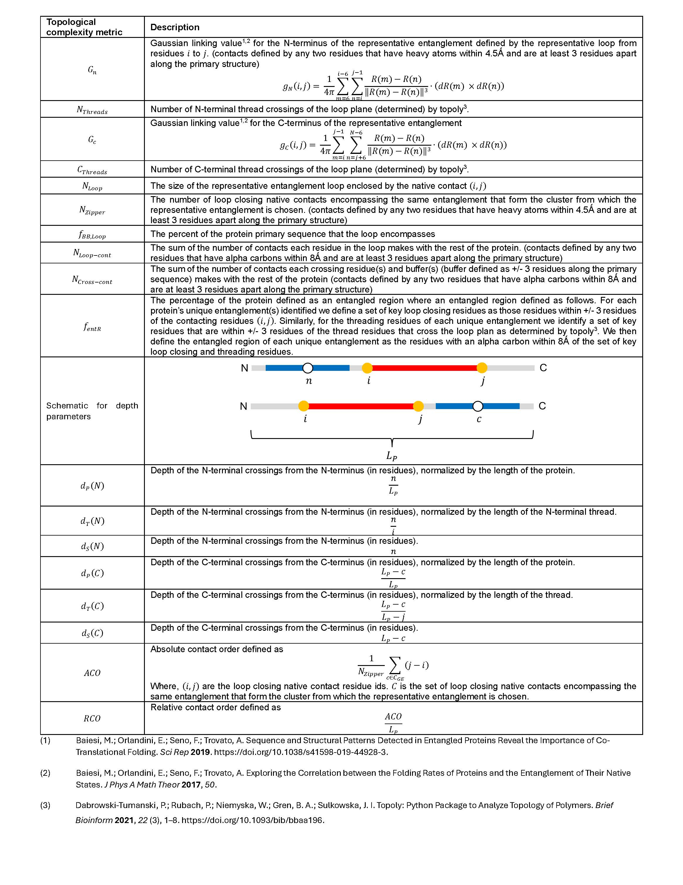

# Protein Entanglement Detection (gaussian_entanglement.py)

This repository contains a suite of scripts for detecting non-covalent lasso entanglements in protein structures using mass spectrometry data. The primary functionality includes preprocessing PDB files, calculating native entanglements, and identifying crossing residues.

## Table of Contents

- [Installation](#installation)
- [Usage](#usage)
- [Functions](#functions)
- [Contributing](#contributing)
- [License](#license)

## Installation

### Prerequisites

Ensure you have the following Python packages installed:

- `numpy` (requires 1.2X)
- `pandas`
- `MDAnalysis`
- `scipy`
- `numba`
- `topoly` (can be installed via pip)

You can install the required packages using:

```sh
pip install numpy pandas MDAnalysis scipy numba topoly
```

### Cloning the Repository

Clone this repository to your local machine:

```sh
git clone https://github.com/yourusername/protein-entanglement-detection.git
cd protein-entanglement-detection
```

## Usage

### Command Line Interface

You can also use the provided command line interface:

```sh
python your_script.py --PDB path/to/pdb --GLN_threshold 0.6 --topoly_density 1 --Calpha False
```
--PDB is the required path to the PDB file to analyze  
  
--GLN_threshold is an optional parameter to vary the threshold we find real entanglements. Any entanglement with a absolute value of the GLN above this threshold will be used. Default = 0.6  
  
--topoly_density is an optional parameter to vary the density of triangles when drawing the minimal loop surface to determine peircing events   
  
--Calpha is a True or False optional parameter to use either 8A between alpha carbons for native contacts or 4.5A between heavy atoms (False, default)  
  
## Output

### Raw entanglement file

File containing 1 entanglement per line separated by "|".  
[0] ChainID  
[1] (loop native contact residue i, loop native contact residue j, crossings)  
[2] Gn  
[3] Gc  
[4] Whether a disulfide bond was identified at the native contact (two SG atoms within 2.2 A)  

## Contributing

Contributions are welcome! Please open an issue or submit a pull request for any improvements or bug fixes.

## License

This project is licensed under the MIT License - see the [LICENSE](LICENSE) file for details.

 
 
# Protein Entanglement Clustering (clustering.py)

This repository contains scripts for clustering non-covalent lasso entanglements in protein structures. The primary functionality includes calculating distances between entanglements, identifying minimal loops, and spatially clustering entanglements based on residue crossings and chiralities.

## Table of Contents

- [Installation](#installation)
- [Usage](#usage)
- [Functions](#functions)
- [Contributing](#contributing)
- [License](#license)

## Installation

### Prerequisites

Ensure you have the following Python packages installed:

- `numpy`
- `scipy`
- `geom_median`
- `collections`
- `itertools`
- `functools`

You can install the required packages using:

```sh
pip install numpy scipy geom_median
```

### Cloning the Repository

Clone this repository to your local machine:

```sh
git clone https://github.com/yourusername/protein-entanglement-clustering.git
cd protein-entanglement-clustering
```
### Calculate Entanglements  

```sh
usage: gaussian_entanglement.py [-h] --PDB PDB [--GLN_threshold GLN_THRESHOLD] [--Calpha CALPHA] [--topoly_density TOPOLY_DENSITY]

Process user specified arguments

options:
  -h, --help            show this help message and exit
  --PDB PDB             Path to PDB file you want to generate raw entanglments for
  --GLN_threshold GLN_THRESHOLD
                        Threshold applied to the absoluate value of the GLN to determine if an entanglement is present
  --Calpha CALPHA       use CA 8A cutoff instead of defualt 4.5A heavy atom cutoff for native contacts
  --topoly_density TOPOLY_DENSITY
                        Density of the triangulation of minimal loop surface for determining pericing. Default=0 to speed up calculations but might cause unrealistic crossings in AF structures with large disorderd loops. Increase to 1 if that is the case

python codes/gaussian_entanglement.py --PDB test_pdbs/P0AD61_4YNG_C.pdb --GLN_threshold 0.6 --Calpha False

# outputs 
File containing 1 entanglement per line separated by "|".  
[0] ChainID  
[1] (loop native contact residue i, loop native contact residue j, crossings) representaive entanglement for the cluster  
[2] Gn  
[3] Gc  
[4] Whether a disulfide bond was identified in one of the loop forming native contact (two SG atoms within 2.2 A)  

>> cat unmapped_GE/P0AD61_4YNG_C_GE.txt 
... Chain C | (22, 322, ['+8']) | 0.8296320600313153 | 0.013503444865087984 | CCbond-False
... Chain C | (23, 315, ['+7']) | 0.7708439185980739 | -0.18254829395449138 | CCbond-False
... Chain C | (23, 321, ['+8']) | 0.7428222270205512 | -0.007883120384376899 | CCbond-False
... Chain C | (23, 325, ['+8']) | 0.7807704022915948 | 0.06370503083496538 | CCbond-False
... Chain C | (26, 322, ['+7']) | 0.7933404875751218 | 0.008571405198053094 | CCbond-False
... Chain C | (26, 325, ['+7']) | 0.8131075079148495 | 0.04511966185215608 | CCbond-False
... Chain C | (26, 326, ['+7']) | 0.8061808737093675 | 0.07027379918067551 | CCbond-False
... Chain C | (26, 329, ['+7']) | 0.8141865694700633 | 0.059135343521623585 | CCbond-False
... Chain C | (27, 325, ['+7']) | 0.7027640703697804 | 0.0753421886303243 | CCbond-False
... Chain C | (28, 325, ['+7']) | 0.6459508163972623 | 0.10311648477073058 | CCbond-False
... Chain C | (382, 460, ['+375']) | 0.754121664338647 | 0 | CCbond-False
... Chain C | (383, 462, ['+375']) | 0.875269225810889 | 0 | CCbond-False
... Chain C | (387, 452, ['+374']) | 0.8668926428053635 | -0.060682253831032706 | CCbond-False
```

### Clustering Entanglements

```sh
usage: clustering.py [-h] --rawENT RAWENT --name NAME [--outdir OUTDIR] [--organism ORGANISM]

Process user specified arguments

options:
  -h, --help           show this help message and exit
  --rawENT RAWENT      Path to raw entanglement file
  --name NAME              An id for the output filename
  --outdir OUTDIR      Output directory for the clustering results
  --organism ORGANISM  Organism to be used for the clustering, Ecoli or Human or Yeast

python codes/clustering.py --rawENT unmapped_GE/P0AD61_4YNG_C_GE.txt --name P0AD61_4YNG_C --organism Ecoli --outdir ./Clustered_GE/ 

# outputs 
File containing 1 entanglement per line separated by "|".  
[0] ChainID  
[1] (loop native contact residue i, loop native contact residue j, crossings) representaive entanglement for the cluster  
[2] Gn  
[3] Gc  
[4] number of loop closing contacts  
[5] ";" separated list of the residueIDs for the loop closing contacts  
[6] Whether a disulfide bond was identified in one of the loop forming native contact (two SG atoms within 2.2 A)  
  
>> cat Clustered_GE/P0AD61_4YNG_C_Clustered_GE.txt
... ID|i|j|c|gn|gc|num_contacts|contacts|CCBond
... Chain C |23|315|+7|0.77084|-0.18255|10|23-315;26-322;26-325;26-326;26-329;27-325;28-325;22-322;23-321;23-325|False
... Chain C |387|452|+374|0.86689|-0.06068|3|387-452;382-460;383-462|False  
```
  
## Output

## Contributing

Contributions are welcome! Please open an issue or submit a pull request for any improvements or bug fixes.

## License

This project is licensed under the MIT License - see the [LICENSE](LICENSE) file for details.


# Calculate the entanglement features 
Calculate various entanglement parameters

### Prerequisites

Ensure you have the following Python packages installed:

- `numpy`
- `argparse`
- `os`
- `sys`
- `pandas`
- `mdtraj`
- `Bio`

```python
usage: EntFeatures.py [-h] -o OUTPATH -p PDB -c CHAIN -l LOG_FILE -t TAG --cluster_file CLUSTER_FILE

Process user specified arguments

options:
  -h, --help            show this help message and exit
  -o OUTPATH, --outpath OUTPATH
                        path to outdir
  -p PDB, --PDB PDB     PDB to process
  -c CHAIN, --chain CHAIN
                        Chain of the PDB to use
  -l LOG_FILE, --log_file LOG_FILE
                        logging file name
  -t TAG, --tag TAG     tag for output file name
  --cluster_file CLUSTER_FILE
                        path to clustered entanglement file

python codes/EntFeatures.py --PDB test_pdbs/P0AD61_4YNG_C.pdb -c C -l EntFeatures_P0AD61_4YNG_C.log -t P0AD61 -o EntFeatures/ --cluster_file clustered_unmapped_GE/P0AD61_clustered_GE.txt
```



# LASSO regression of entanglement complexity features
Takes a directory of the entanglement complexity features and two lists of uniprot accession IDs and permutation tests for differences in the means and medians of each group and LASSO regression for feature selection to discriminate between each group. 

### Prerequisites

Ensure you have the following Python packages installed:

- `numpy`
- `argparse`
- `os`
- `sys`
- `pandas`
- `sklearn`
- `glob`
- `scipy`

```python
usage: Compare_ent_complexity_metrics_generic.py [-h] -g1 GROUP1_GENE_LIST -g2 GROUP2_GENE_LIST -l LOG_FILE -e UENT_FILES -o OUTPATH -p NUM_PERMUTE

Process user specified arguments

options:
  -h, --help            show this help message and exit
  -g1 GROUP1_GENE_LIST, --Group1_gene_list GROUP1_GENE_LIST
                        path to Group1 gene list used for mask. one uniprot name per line. 
  -g2 GROUP2_GENE_LIST, --Group2_gene_list GROUP2_GENE_LIST
                        path to Group2 gene list used for mask. one uniprot name per line.
  -l LOG_FILE, --log_file LOG_FILE
                        Path to logging file
  -e UENT_FILES, --uent_files UENT_FILES
                        path to unique entanglement files
  -o OUTPATH, --outpath OUTPATH
                        path to output directory. will be made if doesnt exist
  -p NUM_PERMUTE, --num_permute NUM_PERMUTE
                        Number of permutations
```

